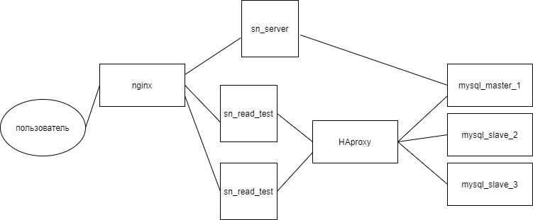

# Домашнее задание №9
05.10-18.10
## Содержание
1. [Задание](#task)
   - [Checklist ](#checklist)
2. [ Ход работы ](#work)
   - [ Разработанная инфраструктура ](#work-infrastructure) 
   - [ Выполнение ](#work-execute)
        - [ Настройка асинхронной репликации ](#work-execute-async-replica)
            - [ Конфигурирование master-а ](#work-execute-async-replica-master-config)
            - [ Конфигурирование первого slave-а ](#work-execute-async-replica-first-slave-config)
            - [ Конфигурирование второго slave-а ](#work-execute-async-replica-second-slave-config)
            - [ Применение миграций ](#work-execute-async-replica-migration)
        - [ Запуск остальной части инфраструктуры ](#work-execute-launch-remaining-infrastructure)
        - [ Нагрузочное тестирование на чтение ](#work-execute-read-stress-testing)
            - [ Выполнение ](#work-execute-read-stress-testing-implementation)
            - [ Результаты ](#work-execute-read-results-stress-testing-implementation)
3. [ Итоги ](#results)

<a name="task"></a>
## Задание
Отказоустойчивость приложений

Цель:
- В результате выполнения ДЗ вы уменьшите число точек отказа в вашем приложении.

В данном задании тренируются навыки:
- проектирование отказоустойчивых архитектур
- настройка nginx
- настройка HAProxy

Требования к выполнению:
- Поднять несколько слейвов MySQL.
- Реализовать соединение со слейвами mysql через haproxy.
- Поднять несколько приложений и обеспечить их балансировку через nginx.
- Воспроизвести нагрузку.
- Под нагрузкой с помощью "kill -9" отключить один из слейвов MySQL.
- Убедится, что система осталась работоспособной.
- Под нагрузкой с помощью "kill -9" отключить один из инстансов бэкенда.
- Убедится, что система осталась работоспособной.

ДЗ принимается в виде отчета по выполненным пунктам.

Критерии оценки:
- Оценка происходит по принципу зачет/незачет.

Требования к отчету:
- Верно описана конфигурация haproxy.
- Верно описана конфигурация nginx.
- Верно описаны условия эксперимента.
- Присутствуют логи работы системы.

<a name="checklist"></a>
### Checklist
1. Выполнение:
    - Поднять несколько слейвов MySQL
    - Реализовать соединение со слейвами mysql через haproxy
    - Поднять несколько приложений и обеспечить их балансировку через nginx
    - Воспроизвести нагрузку
    - Под нагрузкой с помощью "kill -9" отключить один из слейвов MySQL
    - Убедится, что система осталась работоспособной
    - Под нагрузкой с помощью "kill -9" отключить один из инстансов бэкенда
    - Убедится, что система осталась работоспособной
2. Отчет:
    - Верно описана конфигурация haproxy
    - Верно описана конфигурация nginx
    - Верно описаны условия эксперимента
    - Присутствуют логи работы системы

<a name="work"></a>
## Ход работы

<a name="work-infrastructure"></a>
### Разработанная инфраструктура
Для выполнения задания будет достаточно следующего комплекта компонентов:
- одного экземпляра **reverse-proxy и балансировщика nginx**;
- Вместо балансировки микросервиса **social_network**, я добавил сервис, который будет просто делать определенный запрос поиска (sn_read_test). Т.к. у нас mysql мастер всего один, нам нужно воспроизвести тест только по чтению со слейвов.
- трех экземпляров **MySQL**, **один** из которых **master**, **остальные** - **slave**-ы.
- одного экземпляра **reverse-proxy балансировщика HAProxy**.

Разработанная инфраструктура имеет следующее представление: </br>
<p align="center">
    
</p>

<a name="work-execute"></a>
### Выполнение

Поднимаем экземпляры mysql. Пока без экземпляров приложений, т.к. необходимо настроить репликацию:
```shell
docker-compose -f infra/lb_server.dc.yml up -d mysql_node_1 mysql_node_2 mysql_node_3
```

<a name="work-execute-async-replica"></a>
#### Настройка асинхронной репликации

<a name="work-execute-async-replica-master-config"></a>
#### Конфигурирование master-а
Заходим в master-container и открываем конфигурацию, которая располагается по пути **/etc/mysql/conf.d/mysql.cnf**:
```shell script
docker exec -it mysql_node_1 bash
apt-get update && apt-get install -y nano
nano /etc/mysql/conf.d/mysql.cnf
```

Дописываем в конец секции **[mysqld]** следующие строки:
```textmate
[mysqld]
server-id = 1
default_authentication_plugin=mysql_native_password
log-bin = /var/log/mysql/mysql-bin.log
tmpdir = /tmp
binlog_format = STATEMENT
max_binlog_size = 500M
sync_binlog = 1
``` 

Создаем папку mysql в директории */var/log/* папку mysql и даем права доступа к ней пользователю *mysql*:
```shell script
mkdir /var/log/mysql && chown mysql:mysql /var/log/mysql
```

Рестартуем docker-container:
```shell script
docker restart mysql_node_1
```

Переходим в оболочку mysql master-узла MySQL:
```shell script
docker exec -it mysql_node_1 mysql -u root -p
```

Создаем пользователя для репликации:
```mysql based
create user 'replica'@'%' IDENTIFIED BY 'Repl1c@P@$$';
```

Наделяем созданного пользователя полномочиями:
```mysql based
GRANT REPLICATION SLAVE ON *.* TO 'replica'@'%';
```

Вызываем команду *show master* для того, чтобы определить **MASTER_LOG_FILE** и **MASTER_LOG_POS**, которые понадобятся
нам в дальнейшем для настройки slave-ов:
```mysql based
show master status;
+------------------+----------+--------------+------------------+-------------------+
| File             | Position | Binlog_Do_DB | Binlog_Ignore_DB | Executed_Gtid_Set |
+------------------+----------+--------------+------------------+-------------------+
| mysql-bin.000001 |      665 |              |                  |                   |
+------------------+----------+--------------+------------------+-------------------+
```

Теперь необходимо создать пользователя **haproxy_user**. Этот пользователь будет проверять жив ли master и slave 
экземпляры MySQL со стороны HAProxy. Достаточно будет пользователя добавить на стороне master-узла, т.к. затем эта 
информация среплицируется на slave-узлы. Важно, что пароль указывать не надо, иначе haproxy не сможет достучаться до
 экземпляров MySQL. Создадим пользователя:
```mysql
CREATE USER 'haproxy_user'@'%';
```

Выходим из оболочки MySQL командой:
```mysql based
exit
```

<a name="work-execute-async-replica-first-slave-config"></a>
#### Конфигурирование первого slave-а
Заходим в первый slave-container и открываем конфигурацию, которая располагается по пути 
**/etc/mysql/conf.d/mysql.cnf**, c помощью **nano**:
```shell script
docker exec -it mysql_node_2 bash
apt-get update && apt-get install -y nano
nano /etc/mysql/conf.d/mysql.cnf
```

Дописываем в конец секции **[mysqld]** следующие строки:
```textmate
[mysqld]
server-id = 2
default_authentication_plugin=mysql_native_password
log_bin = /var/log/mysql/mysql-bin.log
tmpdir = /tmp
binlog_format = STATEMENT
max_binlog_size = 500M
sync_binlog = 1
``` 

Создаем папку mysql в директории */var/log/* папку mysql и даем права доступа к ней пользователю *mysql*:
```shell script
mkdir /var/log/mysql && chown mysql:mysql /var/log/mysql
```

Рестартуем docker-container::
```shell script
docker restart mysql_node_2
```

Переходим в оболочку mysql контейнера:
```shell script
docker exec -it mysql_node_2 mysql -uroot -p
```

Вносим информацию о master-е:
```mysql based
CHANGE MASTER TO
    MASTER_HOST='mysql_node_1',
    MASTER_USER='replica',
    MASTER_PASSWORD='Repl1c@P@$$',
    MASTER_LOG_FILE='mysql-bin.000001',
    MASTER_LOG_POS=665;
```

Запускаем slave:
```mysql based
start slave;
```

Выводим сводную информацию о состоянии slave-а:
```mysql based
show slave status\G
*************************** 1. row ***************************
               Slave_IO_State: Waiting for master to send event
                  Master_Host: sn_mysql_node1
                  Master_User: replica
                  Master_Port: 3306
                Connect_Retry: 60
              Master_Log_File: mysql-bin.000001
          Read_Master_Log_Pos: 665
               Relay_Log_File: 2cc3d71a57d9-relay-bin.000002
                Relay_Log_Pos: 324
        Relay_Master_Log_File: mysql-bin.000001
             Slave_IO_Running: Yes
            Slave_SQL_Running: Yes
...
```

Для того, чтобы выйти из контейнера, необходимо ввести:
```mysql based
exit
```

<a name="work-execute-async-replica-second-slave-config"></a>
#### Конфигурирование второго slave-а
Заходим во второй slave-container и открываем конфигурацию, которая располагается по пути 
**/etc/mysql/conf.d/mysql.cnf**, c помощью **nano**:
```shell script
docker exec -it mysql_node_3 bash
apt-get update && apt-get install -y nano
nano /etc/mysql/conf.d/mysql.cnf
```

Дописываем в конец секции **[mysqld]** следующие строки:
```textmate
[mysqld]
server-id = 3
default_authentication_plugin=mysql_native_password
log_bin = /var/log/mysql/mysql-bin.log
tmpdir = /tmp
binlog_format = STATEMENT
max_binlog_size = 500M
sync_binlog = 1
``` 

Создаем папку mysql в директории */var/log/* папку mysql и даем права доступа к ней пользователю *mysql*:
```shell script
mkdir /var/log/mysql && chown mysql:mysql /var/log/mysql
```

Рестартуем docker-container::
```shell script
docker restart mysql_node_3
```

Переходим в оболочку mysql контейнера:
```shell script
docker exec -it mysql_node_3 mysql -uroot -p
```

Вносим информацию о master-е:
```mysql based
CHANGE MASTER TO
    MASTER_HOST='mysql_node_1',
    MASTER_USER='replica',
    MASTER_PASSWORD='Repl1c@P@$$',
    MASTER_LOG_FILE='mysql-bin.000001',
    MASTER_LOG_POS=665;
```

Запускаем slave:
```mysql based
start slave;
```

Выводим сводную информацию о состоянии slave-а:
```mysql based
show slave status\G
*************************** 1. row ***************************
               Slave_IO_State: Waiting for master to send event
                  Master_Host: sn_mysql_node1
                  Master_User: replica
                  Master_Port: 3306
                Connect_Retry: 60
              Master_Log_File: mysql-bin.000001
          Read_Master_Log_Pos: 665
               Relay_Log_File: 2cc3d71a57d9-relay-bin.000002
                Relay_Log_Pos: 324
        Relay_Master_Log_File: mysql-bin.000001
             Slave_IO_Running: Yes
            Slave_SQL_Running: Yes
...
```

Для того, чтобы выйти из контейнера, необходимо ввести:
```mysql based
exit
```

<a name="work-execute-async-replica-migration"></a>
#### Применение миграций

Еще одним хорошим способом проверки работы реплик является применение на master-узле MySQL миграций. Для того, чтобы 
накатить миграции выполним:
```shell script
cat sntest_bkp.sql | docker exec -i mysql_node_1 /usr/bin/mysql -u root --password=secretpass sntest
```

Теперь перейдем в контейнеры slave-ов и проверим, что в базе данных появились таблицы. Ниже представлен пример 
для первого slave-а.

Переходим в оболочку MySQL:
```shell script
docker exec -it mysql_node_2 mysql -uroot -psecretpass sntest
```

И выводим список таблиц в распоряжении БД
```mysql based
show tables;
```

Если процесс миграции завершился успехом, должны увидеть следующее:<br />
```textmate
+-------------------+
| Tables_in_sntest  |
+-------------------+
| d_interests       |
| friends           |
| interests         |
| posts             |
| schema_migrations |
| subscribers       |
| users             |
+-------------------+
```

Для того, чтобы выйти из контейнера, необходимо ввести:
```mysql based
exit
```

<a name="work-execute-launch-remaining-infrastructure"></a>
#### Запуск остальной части инфраструктуры
Для того, чтобы поднять все остальные сервисы инфраструктуры, необходимо ввести команду:
```shell script
docker-compose -f infra/lb_server.dc.yml up -d --build
```

<a name="work-execute-read-stress-testing"></a>
#### Нагрузочное тестирование на чтение

<a name="work-execute-read-stress-testing-implementation"></a>
#### Выполнение
Сначала проверим нормальную работу, запустим нагрузочное тестирование командой:
```shell script
wrk http://127.0.0.1:81/mysql --latency -t 10 -c 20 -d 60s
Running 1m test @ http://127.0.0.1:81/mysql
  10 threads and 20 connections
  Thread Stats   Avg      Stdev     Max   +/- Stdev
    Latency    19.62ms    6.32ms 103.82ms   74.32%
    Req/Sec   102.60     17.33   171.00     67.52%
  Latency Distribution
     50%   18.47ms
     75%   22.73ms
     90%   27.54ms
     99%   40.42ms
  61406 requests in 1.00m, 26.59MB read
Requests/sec:   1021.97
Transfer/sec:    453.10KB
```

Далее снова запустим нагрузочное тестирование,
И приблизительно на середине теста останавливаем docker-контейнер MySQL slave-узла 2:
```shell script
docker-compose -f infra/lb_server.dc.yml stop mysql_node_2
```
и ждем окончания нагрузочного теста, который идет 60s.
```textmate
Running 1m test @ http://127.0.0.1:81/mysql
  10 threads and 20 connections
  Thread Stats   Avg      Stdev     Max   +/- Stdev
    Latency    16.68ms   36.76ms   1.06s    97.39%
    Req/Sec   154.83    239.28     1.85k    93.98%
  Latency Distribution
     50%   14.54ms
     75%   20.48ms
     90%   28.13ms
     99%  102.37ms
  92608 requests in 1.00m, 35.15MB read
  Socket errors: connect 0, read 0, write 0, timeout 5
  Non-2xx or 3xx responses: 37007
Requests/sec:   1541.07
Transfer/sec:    599.05KB
```

Затем еще раз проверим нормальную работу, запустим нагрузочное тестирование:
```textmate
Running 1m test @ http://127.0.0.1:81/mysql
  10 threads and 20 connections
  Thread Stats   Avg      Stdev     Max   +/- Stdev
    Latency    21.29ms    9.57ms 143.05ms   83.11%
    Req/Sec    96.47     24.87   161.00     72.29%
  Latency Distribution
     50%   19.24ms
     75%   24.45ms
     90%   31.39ms
     99%   60.28ms
  57704 requests in 1.00m, 24.98MB read
Requests/sec:    960.58
Transfer/sec:    425.88KB
```

Далее снова запустим нагрузочное тестирование,
И теперь приблизительно на середине теста останавливаем docker-контейнер sn_test_2:
```shell script
docker-compose -f infra/lb_server.dc.yml stop sn_test_2
```
и ждем окончания нагрузочного теста, который идет 60s.
```textmate
Running 1m test @ http://127.0.0.1:81/mysql
  10 threads and 20 connections
  Thread Stats   Avg      Stdev     Max   +/- Stdev
    Latency     9.82ms   10.38ms 141.60ms   82.73%
    Req/Sec   210.06    349.72     2.22k    90.57%
  Latency Distribution
     50%    1.82ms
     75%   17.77ms
     90%   23.57ms
     99%   37.88ms
  86547 requests in 1.00m, 31.07MB read
  Non-2xx or 3xx responses: 47947
Requests/sec:   1440.06
Transfer/sec:    529.38KB
```

Затем еще раз проверим нормальную работу, запустим нагрузочное тестирование:
```textmate
Running 1m test @ http://127.0.0.1:81/mysql
  10 threads and 20 connections
  Thread Stats   Avg      Stdev     Max   +/- Stdev
    Latency    20.91ms    9.09ms 110.20ms   72.71%
    Req/Sec    97.09     19.93   171.00     70.91%
  Latency Distribution
     50%   19.31ms
     75%   25.52ms
     90%   32.48ms
     99%   50.29ms
  58118 requests in 1.00m, 25.16MB read
Requests/sec:    967.06
Transfer/sec:    428.75KB
```

<a name="work-execute-read-results-stress-testing-implementation"></a>
#### Результаты

Из результатов видно, что несмотря на "переходные" периоды при балансировке,
сервис продолжал работать.
Результат можно считать успешным. Nginx и HAProxy справились со своей задачей.

<a name="results"></a>
## Итоги
В ходе выполнения задания:
- был описан процесс сборки и конфигурирования программного комплекса;
- была настроена async MySQL репликация между master и двумя slave-узлами;
- был верно сконфигурирован HAProxy, выступающий балансировщиком между доступными MySQL узлами;
- был верно сконфигурирован nginx, выступающий reverse-proxy и балансировщиком перед пользователем;
- был проведено нагрузочное тестирование, показавшее устойчивую инфраструктуру в случае сбоев; 
- были проанализированы результаты нагрузочного тестирования, доказывающие пригодность предложенной инфраструктуры.
