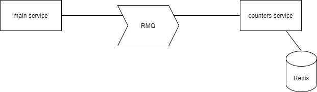

# Домашнее задание №10
19.10-25.10
## Содержание
1. [Задание](#task)
    - [Checklist ](#checklist)
2. [ Ход работы ](#dev)
   - [ Выполнение ](#dev-execute)
3. [ Итоги ](#results)

## Задание
Сервис счетчиков

Цель:
- В результате выполнения ДЗ вы создадите сервис счетчиков. Сервис будет хранить такие счетчики, как число непрочитанных сообщений.

В данном задании тренируются навыки:
- разработка отказоустойчивых сервисов
- использование кешей

Требования к выполнению:
- Разработайте сервис счетчиков.
- Учтите то, что на этот сервис будет большая нагрузка, особенно на чтение.
- Продумайте, как обеспечить консистентность между счетчиком и реальным числом непрочитанных сообщений. Например, используйте паттерн SAGA.
- Внедрите сервис для отображения счетчиков.

ДЗ сдается в виде демонстрации работоспособности сервиса, ссылки на репозиторий github, отчета по архитектуре.

Критерии оценки:
- Оценка происходит по принципу зачет/незачет.

Требования к отчету:
- Верно описан выбранный паттерн обеспечения консистентности.
- Выбранная архитектура сервиса подходит для решения задачи.

### Checklist
1. Выполнение:
    - Разработайте сервис счетчиков непрочитанных сообщений.
    - Учесть большую нагрузку, особенно на чтение.
    - Обеспечить консистентность между счетчиком и реальным числом непрочитанных сообщений.
2. Отчет:
    - Верно описан выбранный паттерн обеспечения консистентности
    - Выбранная архитектура сервиса подходит для решения задачи

## Ход работы

### Выполнение

Был разработан отдельный микросервис с счетчиками, в этом сервисе хранится по два значения счетчика на каждого пользователя:
- total, общее количество сообщений в ленте пользователя.
- cursor, текущее количество сообщений прочитанных пользователем.
Данные хранятся в redis.
Основной сервис и сервис счетчиков сообщаются через rmq.
В очереди есть три вида сообщений:
- инкремент total, кладется при добавлении нового поста, на всех подписчиков.
- инкремент cursor, кладется при удалении поста, на всех подписчиков.
- обновление cursor, кладется при чтении пользоватем ленты, на пользователя.

Сервис счетчиков читает rmq и запускает соответствующую обработку.
Данные обновляются в redis.
В сервисе счетчиков был добавлен endpoint для чтения значения непрочитанных соообщений в разрезе пользователя.
Само значение определяется так:
unread_count = total - cursor

    

## Итоги
- Был разработан сервис счетчиков.
- Был добавлен endpoint для вывода значения счетчиков.
- Сервис способен держать большую нагрузку, особенно на чтение.
- Была обеспечена консистентность между отдаваемым значением и реальным числом непрочитанных сообщений.
