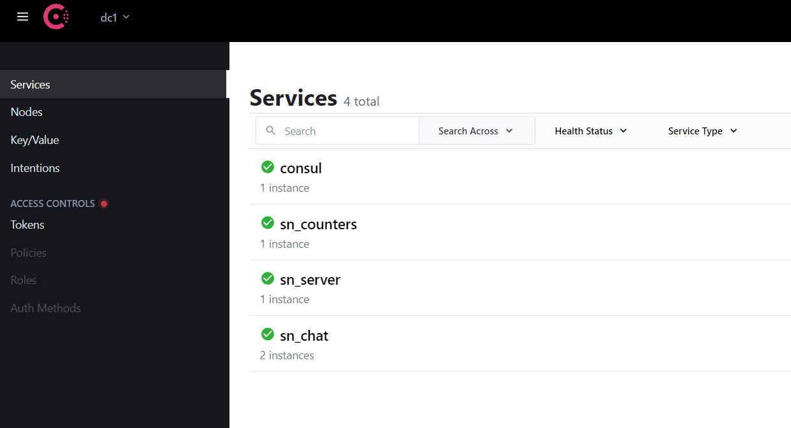

# Домашнее задание №11
26.10-01.11
## Содержание
1. [Задание](#task)
    - [Checklist ](#checklist)
2. [ Ход работы ](#dev)
   - [ Контейнеризация с помощью docker ](#docker-containerization) 
   - [ Механизм auto-discovery и consul ](#auto-discovery)
   - [ Сборка и запуск инфраструктуры ](#build-infrastructure)
3. [ Итоги ](#results)

<a name="task"></a>
## Задание
Внедрение docker и consul

Цель:
- В результате выполнения ДЗ вы интегрируете в ваш проект социальной сети docker и auto discovery сервисов с помощью consul

В данном задании тренируются навыки:
- использование docker
- использование consul
- построение auto discovery

Требования к выполнению:
- Обернуть сервис диалогов в docker
- Развернуть consul в вашей системе
- Интегрировать auto discovery в систему диалогов
- Научить монолитное приложение находить и равномерно нагружать все поднятые узлы сервиса диалогов
- Опционально можно использовать nomad

ДЗ сдается в виде репозитория с исходными кодами на github и отчетом о выполненных шагах.

Критерии оценки:
- Оценка происходит по принципу зачет/незачет.

Требования к отчету:
- Верно настроен docker.
- Обеспечено распределение нагрузки по экземплярам сервиса.
- Описан процесс развертки новых экземпляров.

<a name="checklist"></a>
### Checklist
- Обернуть сервис диалогов в docker
- Описать процесс развертки новых экземпляров
- Развернуть consul в вашей системе
- Интегрировать auto discovery в систему диалогов
- Научить монолитное приложение находить и равномерно нагружать все поднятые узлы сервиса диалогов

<a name="dev"></a>
## Ход работы

<a name="docker-containerization"></a>
### Контейнеризация с помощью docker

Были контейнеризированы в виде отдельно-независимых docker-контейнеров все микросервисы системы, а именно:
- sn_server
- sn_counters
- sn_chat

Сборка docker-image'ов представляла собой multi-stage-сборку. Т.е. изначально собирался binary-файл и уже на втором этапе прокидывался в пустой image, в котором отсутствует лишнее.
Подробнее о multi-stage сборке, можно узнать [здесь](https://docs.docker.com/develop/develop-images/multistage-build/).

Сами docker-файлы микросервисов:
- [Dockerfile для sn_server](https://github.com/tyghr/sn_hltest/blob/master/infra/server.Dockerfile);
- [Dockerfile для sn_counters](https://github.com/tyghr/sn_hltest/blob/master/infra/counters.Dockerfile);
- [Dockerfile для sn_chat](https://github.com/tyghr/sn_hltest/blob/master/infra/chat.Dockerfile);

Кроме того, были докеризированы и инфраструктурные компоненты системы, а именно:
- MySQL БД для микросервиса sn_server;
- Redis для кэширования ленты новостей на стороне микросервиса sn_server а также для сервиса счетчиков;
- RabbitMQ;
- Consul.

Вся представленная выше инфраструктура собрана в виде docker-compose файла, который располагается [здесь](https://github.com/tyghr/sn_hltest/blob/master/infra/consul_server.dc.yml)

<a name="work-auto-discovery"></a>
### Механизм auto-discovery и механизм балансировки через consul
Механизм auto-discovery представлен достаточно просто. Для этого необходимо, пользуясь API Consul:
- зарегистрировать сервис, при его запуске;
- выполнить обратную операцию регистрации, называемую *deregister* в API Consul'а, при завершения работы сервиса;
- реализовать health-check endpoint для Consul'а, с помощью которого Consul будет определять "живучесть" микросервиса.

GO-имплементация вышесказанного на примере микросервиса **sn_chat** представлена [здесь](https://github.com/tyghr/sn_hltest/blob/master/internal/consul/agent/consul.go).


Механизм балансировки через consul осуществляется так же через его API.
Для этого необходимо, зная интересующее наименование микросервиса, в данном случае это *sn_chat*, периодически (в отдельной горутине) получать адреса активных экземпляров через consul API;

GO-имплементация вышесказанного на примере микросервиса **balancer**, который балансирует нагрузку, представлена [здесь](https://github.com/tyghr/sn_hltest/blob/master/internal/consul/balancer/consul.go).

<a name="work-build-infrastructure"></a>
### Сборка и запуск инфраструктуры

Поднимаем инфраструктуру:
```shell
docker-compose -f infra/consul_server.dc.yml up -d --build
```

Зарегистрированные микросервисы в консоли UI consul'а выглядят так:<br />
<p align="center">
   
</p>


Также можно увидеть два зарегистрированных экземпляра одного и того же микросервиса по одному наименованию:  
<p align="center">
   
</p>

Остановим первый экземпляр микросервиса sn_chat.
```shell script
 docker stop sn_chat_1
```
И видим, что consul отметил его, как недоступный.

<p align="center">
   
</p>

Consul также не вернет его в списке доступных адресов balancer'у, поэтому запросы будут идти на другие экземпляры.

<a name="results"></a>
## Итоги
В ходе выполнения задания:
- был описан процесс сборки и конфигурирования программного комплекса
- были контейнеризированы все микросервисы проекта и использующие инфраструктурные компоненты (БД, кеш, брокер сообщений
  и т.д.);  
- был реализован механизм auto-discovery на стороне микросервисов проекта;
- был реализован механизм балансировки нагрузки между несколькими экземплярами микросервисов диалогов (sn_chat) при помощи consul.
