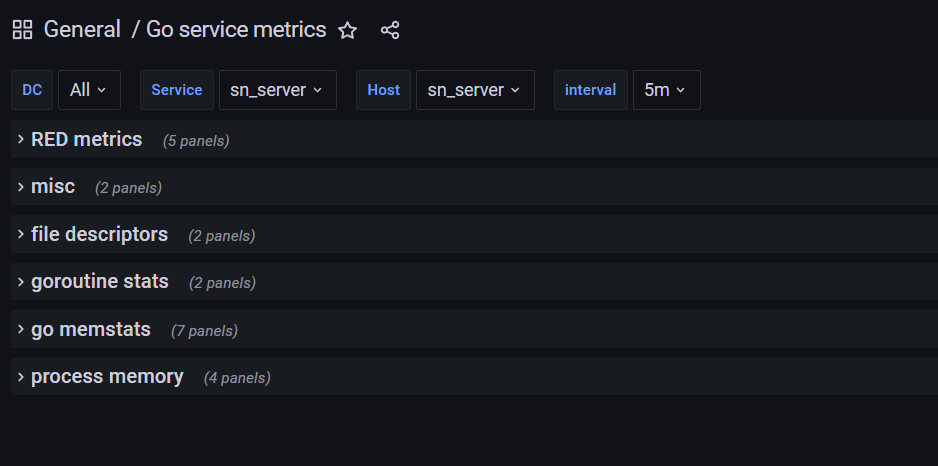

# Домашнее задание №12
02.11-22.11
## Содержание
1. [Задание](#task)
    - [Checklist ](#checklist)
2. [ Ход работы ](#dev)
   - [ Мониторинг с помощью Zabbix ](#dev-zabbix)
   - [ Мониторинг с помощью Prometheus ](#dev-prometheus)
   - [ Визуализация метрик с помощью Grafana ](#dev-grafana)
3. [ Итоги ](#results)

<a name="task"></a>
## Задание
Мониторинг

Цель:
- В результате выполнения ДЗ вы организуете мониторинг своего сервиса.

В данном задании тренируются навыки:
- эксплутация prometheus
- эксплутация grafana
- эксплутация zabbix

Требования к выполнению:
- развернуть zabbix
- развернуть prometheus
- развернуть grafana
- начать писать в prometheus бизнес-метрики основного сервиса по принципу RED
- начать писать в zabbix технические метрики сервера с основным сервисом
- организовать дашборд в grafana

ДЗ сдается в виде отчета со скриншотами.

Критерии оценки:
- Оценка происходит по принципу зачет/незачет

Требования к отчету:
- Сбор технических метрик осуществляется верно.
- Сбор бизнес метрик осуществляется верно по принципу RED.
- В grafana организован дашборд.

<a name="checklist"></a>
### Checklist
- развернуть zabbix, prometheus, grafana
- начать писать в prometheus бизнес-метрики основного сервиса по принципу RED
- начать писать в zabbix технические метрики сервера с основным сервисом
- организовать дашборд в grafana

<a name="dev"></a>
## Ход работы

Я изменил в постановке задачи, сделать мониторинг не сервиса чатов, а мониторинг основного сервиса.
Т.к. в сервисе чатов сейчас только один endpoint на websocket'ах.

<a name="dev-zabbix"></a>
## Мониторинг с помощью Zabbix

Поднимаем инфраструктуру:
```shell
docker-compose -f infra/server.dc.yml up -d --build
```

Для того, чтобы слать метрики, необходим сервер zabbix-а с хранилищем для их персистентности и zabbix-frontend для их конфигурирования и отображения в виде dashboard-ов.
Все перечисленные компоненты подняты в docker-контейнерах, а именно:
- в качестве хранилища был выбран [postgres/12-alpine]
- в качестве zabbix-сервера был выбран [zabbix/zabbix-server-pgsql]
- в качестве zabbix-frontend'а был выбран [zabbix/zabbix-web-nginx-pgsql]

Подробнее docker-compose можно посмотреть [здесь](https://github.com/tyghr/sn_hltest/blob/master/infra/server.dc.yml).

Далее необходимо настроить zabbix. 
Перейдем на http://localhost:8085/. Введем **Username** (**Admin**) и **Password** (**zabbix**). Это учетные данные по умолчанию.

Далее, находясь на вкладке **Configuration**, необходимо выбрать **Hosts**, как показано на рисунке:</br>
<p align="center">
   
</p>

Далее, находясь во вкладке **Hosts**, выбираем **Items**:</br>
<p align="center">
   
</p>

Затем необходимо нажать на кнопку **Create item** для создания метрики:</br>
<p align="center">
   
</p>

После этого, мы попадаем на форму, на которой должны создать каждую из метрик. </br>
<p align="center">
   
</p>

Для этого обязательно:
- выбираем в секции **Type** - **Zabbix trapper**;
- даем наименование метрики в секции **Name**;
- даем уникальный идентификатор метрики или ключ **Key**, по которому со стороны приложения будем ее отсылать;
- и тип **Type of information** самой метрики (numeric, text and ect.) 

В моем случае я создал **шесть** технических метрик: три по **memory** и три по **cpu**. При просмотре всех метрик в
секции **Configuration** -> **Hosts** -> **Items**, пролистав метрики zabbix'а, можно увидеть только что созданные:</br>
<p align="center">
   
</p>

Для того, чтобы увидеть значения метрик, необходимо перейти во вкладку **Monitoring** -> **Last data**.
В моем случае представление будет следующим:</br>
<p align="center">
   
</p>

Далее необходимо перейти в секцию **Graph**, для того, чтобы на графике увидеть динамику развития метрики. В качестве
примера выступает метрика по свободной оперативной машины **mem-free**, на которой расположен основной микросервис: </br>
<p align="center">
   
</p>

и метрика по использованию CPU **cpu-user**: </br>
<p align="center">
   
</p>

Метрики собираются на стороне основного микросервиса с периодичностью пять секунд при помощи go-библотеки [go-osstat](https://github.com/mackerelio/go-osstat).
Сама реализация представлена [тут](https://github.com/tyghr/sn_hltest/blob/master/internal/infra/zabbix/zabbix.go).

<a name="dev-prometheus"></a>
## Мониторинг с помощью Prometheus 

Перед тем как начать писать метрики в prometheus, необходимо сделать следующее:
- создать на стороне основного микросервиса GET HTTP-endpoint c наименованием **/metrics**, откуда сам prometheus в виде pull-опроса будет собирать метрики;
- в конфигурации самого prometheus, в секции **scrape_configs**, необходимо создать очередную job'у.
В поле **targets** необходимо указать адрес экземпляра, с которого будет собираться метрика. В данном случае это адрес самого микросервиса.

Для того чтобы не писать свою реализацию сбора RED-метрик, воспользуемся готовой go-библиотекой - [go-http-metrics](https://github.com/slok/go-http-metrics).
В данном случае это простая middleware, которая без лишних телодвижений inject-ится в http-router.

<a name="dev-grafana"></a>
### Визуализация метрик с помощью Grafana

Для того чтобы визуализировать собранные RED-метрики prometheus-ом, воспользуемся grafana-ой.  
Перейдем на страницу: http://localhost:3000  
Нас попросят так же ввести **username** и **password**. По умолчанию, **admin** и **admin**.

Переходим на вкладку **Configuration->Datasources** и добавляем источник данных - prometheus.
<p align="center">
   
</p>

Далее импортируем [dashboard](https://github.com/tyghr/sn_hltest/blob/master/homework/files/go_service_metrics.dashboard)
<p align="center">
   
</p>

Dashboard должен сразу открытся. Также он должен появится в списке.  
При выборе данного dashboard'а, должны увидеть следующее:
<p align="center">
   
</p>

Секции **misc**, **file description**, **goroutine stats**, **go memstats** и **process memory** являются производными от библиотеки [go-prometheus](https://github.com/prometheus/client_golang/),
которая собирает все представленными в этих секциях метрики по умолчанию, а именно:
- в секции **misc** представлены метрики об GC и указателях
- в секции **file description** представлены метрики файловых дескрипторах
- в секции **goroutine stats** приведена сводка по запущенным goroutine-ам и потокам
- в секции **go memstats** приведена сводка по используемой памяти в основном микросервисе (аллокации, heap, stack)
- в секции **process memory** приведена сводка по resident и virtual памяти

И наконец секция **RED metrics**. Здесь отображены пять панелей.
<p align="center">
   
</p>

- первая **Rate - the number of requests, per second** по своей сути отражает первую букву из аббревиатуры RED.
Т.е. количество запросов в единицу времени (секунду). 
- вторая **Errors - the number of failed requests, per second** отражает вторую букву из аббревиатуры RED.
Т.е. количество неудачных запросов в единицу времени (секунду).
- третья, четвертая и пятая панели - **Duration - The amount of time each request takes expressed as a time interval**
отражают последнюю букву D.
Т.е. количество затраченного времени на осуществление каждого из запросов за определенный интервал времени.
В данном случае представлены 90, 95 и 99 квантили для того, чтобы выпукло продемонстрировать метрику.  

<a name="results"></a>
## Итоги
В ходе выполнения задания:
- описан сбор технических метрик в zabbix
- реализован сбор бизнес метрик по принципу RED в prometheus
- создан дашборд в grafana
